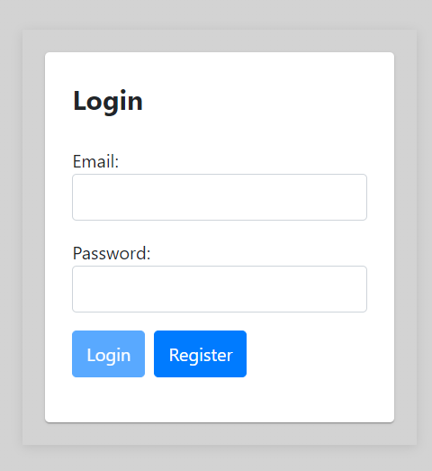
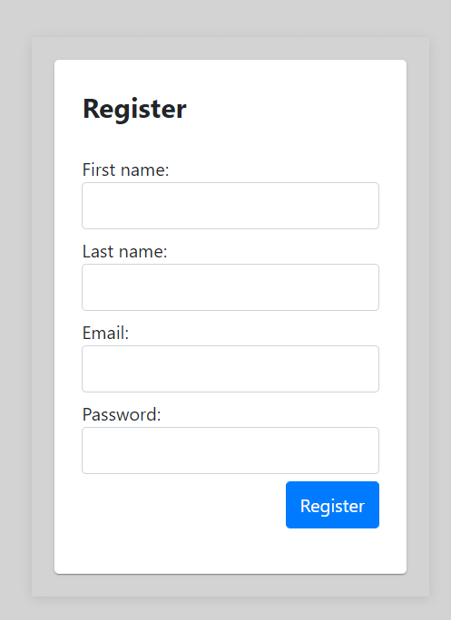
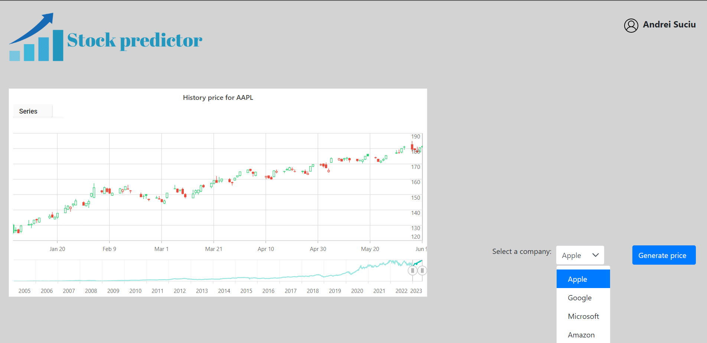

# StockPricePredictor

Web app that **visualizes historical stock prices** and **predicts the closing price** using an **LSTM** model trained on technical indicators.

---

## Features
- **Sign in / Sign up** with **JWT**; protected routes in the UI.
- **Historical charts** for selected tickers (line / candlestick / hollow).
- **Prediction** of the **closing price 6 days ahead**.
- **Result check**: when the real price becomes available, the app compares it with the previously generated prediction and notifies the user.
- **Automated data updates** and **periodic model retraining**.

---

## Tech Stack
- **Frontend:** Angular, PrimeNG, Syncfusion EJ2 Charts  
- **Backend:** Python 3.x, Flask (REST), JWT  
- **ML:** TensorFlow/Keras (LSTM + Dense + Dropout), MinMax scaling  
- **Data:** `yfinance` (Yahoo Finance)  
- **Database:** MySQL  
- **Scheduling:** daily data refresh, 100-day retraining cadence

---

## GUI

---

## ML Overview

- **Input features (per day):** `Open`, `Close`, `Williams %R`, `RSI`
- **Window:** last **10** days → model input
- **Target:** `Close` **+6 days**
- **Network:**  
`LSTM(64, return_sequences)` → `Dropout(0.3)` →  
`LSTM(128)` → `Dropout(0.3)` →  
`Dense(256, activation=tanh, HeUniform)` → `Dropout(0.3)` →  
`Dense(128, activation=tanh, HeUniform)` → `Dropout(0.3)` →  
`Dense(1)`
- **Training:** `optimizer=Adam`, `loss=MSE`, `epochs=50`
- **Scaling:** MinMax per time segment

